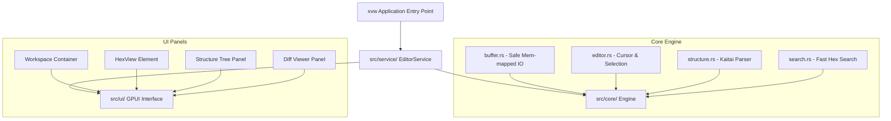

<div align="center">
  
  
  <h1>XVW</h1>
  <p><strong>A next-generation, high-performance binary viewer built with Rust and GPUI.</strong></p>

  <p>
    <a href="https://github.com/rust-lang/rust"></a>
    <a href="https://gpui.rs/"></a>
    <a href="https://tokio.rs/"></a>
    <a href="https://github.com/kaitai-io/kaitai_struct"></a>
  </p>

  <h4>⚡ Sleek. Responsive. Hardware-Accelerated. Extensible. ⚡</h4>
  
  ---
</div>

## 🌐 Introduction

**XVW** (pronounced *X-View*) is a revolutionary, modern binary viewer built from the ground up to address the limitations of legacy tools. Traditional binary inspection tools are often slow, lack deep structure parsing, and rely on dated user interface layouts.

Built on the ultra-responsive **GPUI framework** (the hardware-accelerated UI toolkit powering the Zed editor) and backed by the multi-threaded power of **Rust & Tokio**, XVW delivers an instantaneous, fluid, and immersive environment for reverse engineers, security analysts, firmware developers, and binary tinkerers to inspect and analyze binary data.

---

## ✨ Features that Define the Future

### 🏎️ Hardware-Accelerated Sub-Millisecond Rendering
Say goodbye to UI lag. By using GPUI's GPU-native rendering pipeline, XVW achieves perfect **120 FPS fluid scrolling** and handles gigabyte-scale files with zero latency.

### 🧬 Dynamic Binary Structure Parsing (Kaitai Struct)
Stop guessing what individual bytes mean. XVW includes a fully integrated **dynamic Kaitai Struct interpreter** (`.ksy`).
- **Runtime Loadable:** Load structure definitions on the fly without restarting the application.
- **Visual Breakdown:** View complex binary layouts (e.g., custom protocols, ELF/PE/Mach-O headers, image formats) as interactive, color-coded structure trees.
- **Interactive Navigation:** Click a structure field to instantly jump the cursor and selection to its corresponding byte offset.

### 🎭 Visual Binary Diffing
Compare files side-by-side with pixel-perfect accuracy.
- **Locked Scroll:** Scroll through both files simultaneously.
- **Visual Callouts:** Spot precise differences, insertions, and modifications with high-contrast, theme-harmonious visual indicators.

### 📐 Adaptive Line Formatting & Breakpoints
Traditional binary viewers force rigid 16-byte boundaries. XVW empowers you to **customize the layout grid**:
- Manually inject custom row breaks to align the hex view with structural data packets.
- Define custom grid widths to match variable-length records perfectly.

### 🌐 Universal Encoding Engine
Interpret data in any format. Synchronously view hex alongside:
- Standard **ASCII**
- Multi-byte **UTF-8**
- **UTF-16 LE / BE** (Little Endian / Big Endian)

### ⌨️ Vim-Inspired Fluid Controls
Navigate files entirely from the home row. Use familiar Vim shortcuts (`h`, `j`, `k`, `l` navigation, and `/` for regex-based hex and text searches) to maintain maximum analysis speed.

---

## 🎨 Design & Aesthetic Philosophy

XVW believes developers deserve beautiful interfaces.
- **Premium Dark Mode:** Highly curated color palettes optimized to reduce eye strain over long analysis sessions.
- **Micro-Animations:** Subtle transitions when toggling views, switching panels, or selecting ranges to make the application feel reactive and alive.
- **Clean Typography:** Custom rendering of tabular data using premium monospace typefaces, ensuring maximum legibility of hex characters and ASCII previews.

---

## 🛠️ Modularity & Architecture

XVW is engineered with modular design at its core:



- **`src/core/`**: The core binary engine containing high-speed search, memory-mapped buffer management, and Kaitai parser binding.
- **`src/ui/`**: Responsive GPUI panels (EditorPanel, DiffPanel, FileTreePanel, SettingsPanel) and performance-focused hex grid rendering elements.
- **`src/service/`**: Orchestration logic managing application states, multithreaded tasks, and active documents.

---

## 🚀 Building & Running

### 📋 Prerequisites

Install the latest stable version of **Rust** via [rustup.rs](https://rustup.rs/).

### ⚡ Quick Start

```bash
# 1. Clone this repository and navigate to its folder
cd xvw

# 2. Build and run the binary instantly
cargo run [optional_file_or_folder_path]

# 3. Compile a high-performance release binary
cargo build --release

# 4. Run the comprehensive engine test suite
cargo test
```

### ⌨️ Standard Shortcuts

| Keybinding | Action |
|---|---|
| `cmd-o` | Open File Dialog |
| `cmd-shift-o` | Open Folder |
| `cmd-b` | Toggle Left Sidebar |
| `cmd-f` | Trigger Hex/Text Search |
| `cmd-shift-s` | Load Kaitai Structure Definition |
| `cmd-,` | Open Settings Panel |
| `cmd-q` | Quit XVW |

---

*Built with passion, Rust, and GPUI.*
